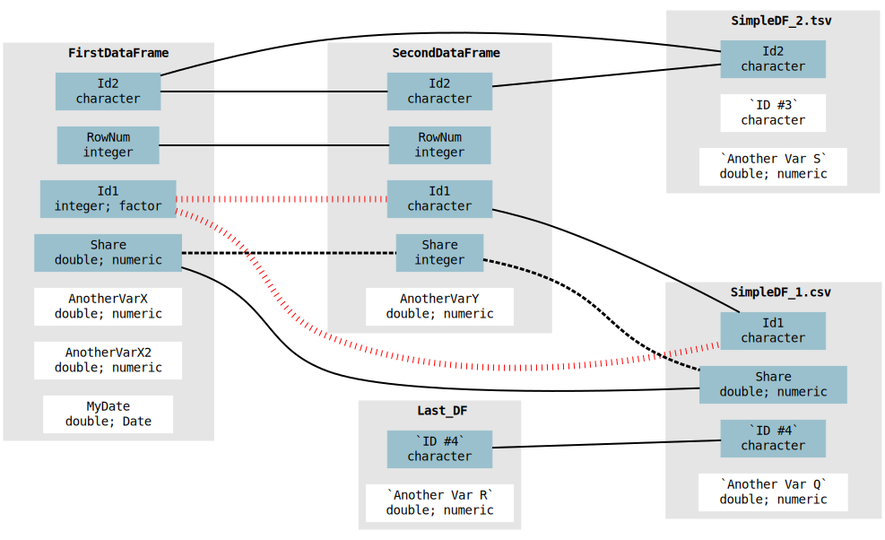

<!-- build this doc with: rmarkdown::render('README.Rmd') -->

```{r setup, include=FALSE}
knitr::opts_chunk$set(echo = TRUE)
schema <- function(...)
  cat(DiagrammeRsvg::export_svg(autoschema::schema(...)), file='plot.svg')
set.seed(123) # to avoid git changes due to runif()
```

This is a one-function package. Its sole function
[autoschema](https://github.com/alekrutkowski/autoschema)::[schema](https://rdrr.io/github/alekrutkowski/autoschema/man/schema.html)
shows the linkages between data.frames and/or csv/tsv files based on their column names and column types/classes. See the usage example below.

The `schema` function uses the **column names** and **column types/classes** of data.frames
and/or csv/tsv files to produce a schema diagram of relations between these
tables. The inter-connected columns are shaded blue ().<br>By default, "correct" relations (same column names and same types/classes)
are drawn as solid black lines ().<br>If there are evident type/class mismatches
despite the same column names, the relation is drawn as a striped red line<br>().
If there is a slight mismatch that can be overcome by automatic coercion
(integer-double, but both columns numeric) the relation line is dashed but black<br>().

#### Dependencies

[data.table](https://CRAN.R-project.org/package=data.table)::[fread](https://rdrr.io/cran/data.table/man/fread.html),&nbsp;
[DiagrammeR](https://CRAN.R-project.org/package=DiagrammeR)::[grViz](https://rdrr.io/cran/DiagrammeR/man/grViz.html),&nbsp;
[DiagrammeRsvg](https://CRAN.R-project.org/package=DiagrammeRsvg)::[export_svg](https://rdrr.io/cran/DiagrammeR/man/export_svg.html).

#### Installation

```{r, eval=FALSE}
remotes::install_github('alekrutkowski/autoschema')
```

## Example

#### Prepare some fake data

```{r data-prep}
DF <- function(...)
  data.frame(...,
             stringsAsFactors=FALSE,
             check.names=FALSE) # to allow for spaces in some column names
FirstDataFrame <-
  DF(RowNum = 1:10,
     Id1 = as.factor(letters[1:10]), # factors are actually integers
     Id2 = letters[1:10],
     Share = seq(0.73, 1.00, 0.03), # as fraction [0,1]
     AnotherVarX = runif(10),
     AnotherVarX2 = runif(10),
     MyDate = as.Date(1e4*runif(10),origin='1899-12-30'))
SecondDataFrame <-
  DF(RowNum = 5:14,
     Id2 = letters[5:14],
     Id1 = letters[5:14],
     Share = as.integer(100*seq(0.73, 1.00, 0.03)), # as % [0,100]
     AnotherVarY = runif(10))
SimpleDF_1 <-
  DF(Id1 = letters[3:12],
     `ID #4` = LETTERS[6:15],
     Share = runif(10),
     `Another Var Q` = runif(10))
SimpleDF_2 <-
  DF(Id2 = letters[3:12],
     `ID #3` = LETTERS[6:15],
     `Another Var S` = runif(10))
write.csv(SimpleDF_1, 'SimpleDF_1.csv',
          row.names=FALSE)
write.table(SimpleDF_2, 'SimpleDF_2.tsv', sep='\t',
            row.names=FALSE)
Last_DF <-
  DF(`ID #4` = LETTERS[2:5],
     `Another Var R` = runif(4))
```

#### Plot the linkages

```{r plot, echo=TRUE, warning=FALSE}
schema(
  data_frames = list(FirstDataFrame, SecondDataFrame), # or even more data.frames
  data_frame_names = c('Last_DF'), # can be more than 1 data.frame name
  csv_files = c('SimpleDF_1.csv', 'SimpleDF_2.tsv') # can be more than 2 files
)
```



#### Alternative output options

`autoschema::schema` can alternatively produce [GraphViz DOT code](https://en.wikipedia.org/wiki/DOT_(graph_description_language))
(with `output_type='gv'`) or [SVG XML code](https://en.wikipedia.org/wiki/Scalable_Vector_Graphics#Example) (with `output_type='svg'`)
for further tweaks in the appropriate apps (e.g. https://graphviz.org/resources and https://inkscape.org/develop/about-svg).
